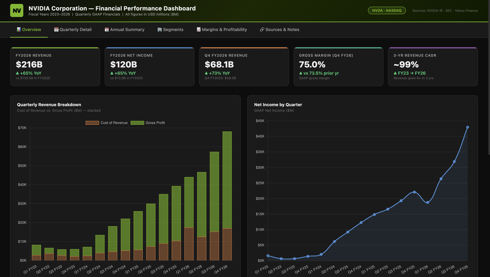

# 📊 Financial Dashboard Skill for Claude



A Claude skill for building **professional financial performance dashboards** for any public company, powered by publicly available earnings data (IR press releases, SEC EDGAR, Yahoo Finance).

## What It Does

Give Claude a company name and a time range, and it will:

- **Research** quarterly and annual financials from official IR press releases, SEC EDGAR, and Yahoo Finance
- **Build a dashboard** in your choice of format:
  - **Excel (.xlsx)** — 5-sheet professional workbook with charts, color-coded financials, segment analysis, and a sources sheet
  - **Interactive HTML** — dark-mode, single-file browser dashboard with Chart.js charts, tab navigation, KPI cards, and FY filter buttons
  - **Both** — when you want offline analysis *and* browser visualization

## Example Prompts

```
Build a financial dashboard for Nvidia covering FY2023 to FY2026
```
```
Create an earnings visualization for Apple — quarterly revenue, margins, and EPS
```
```
Make an interactive HTML dashboard for Microsoft like you did for Nvidia
```
```
Show me IBM's quarterly financial performance for the last 3 years
```

## Metrics Covered

| Category | Metrics |
|----------|---------|
| Revenue | Total Revenue, YoY Growth % |
| Costs | Cost of Revenue, Operating Expenses |
| Profitability | Gross Profit, Operating Income, Net Income |
| Margins | Gross Margin %, Operating Margin %, Net Margin % |
| Per Share | Diluted EPS |
| Segments | Revenue breakdown by business unit (if available) |

## Sample Output

The dashboards were built and tested on NVIDIA (FY2023–FY2026):
- Revenue grew from **$27B → $216B** in 3 years (~99% CAGR)
- Interactive charts with hover tooltips, FY filter buttons, annual vs. quarterly views
- Sources and methodology notes for every data point

## Installation

### Add to Claude (Claude Code or Cowork)

```
/plugin marketplace add baofeng-dong/financial-dashboard-skill
/plugin install financial-dashboard@baofeng-skills
```

### Manual install (`.skill` file)

Download `financial-dashboard-skill.skill` from [Releases](https://github.com/baofeng-dong/financial-dashboard-skill/releases) and install it in Claude.

## Data Sources

All data is sourced from publicly available materials:

- Company investor relations pages (e.g. `investor.nvidia.com`)
- SEC EDGAR — 10-K and 10-Q filings
- Yahoo Finance income statement data
- StockAnalysis.com quarterly tables

## Fiscal Year Handling

NVIDIA, Microsoft, Apple, and many other large-cap companies use non-calendar fiscal years.
The skill automatically maps fiscal quarters to calendar periods and notes FY offsets clearly
in the Sources sheet.

## License

MIT — free to use, modify, and distribute.

---

*Built with [Claude Cowork](https://claude.ai) | Skill format: [Anthropic Skills](https://github.com/anthropics/skills)*
